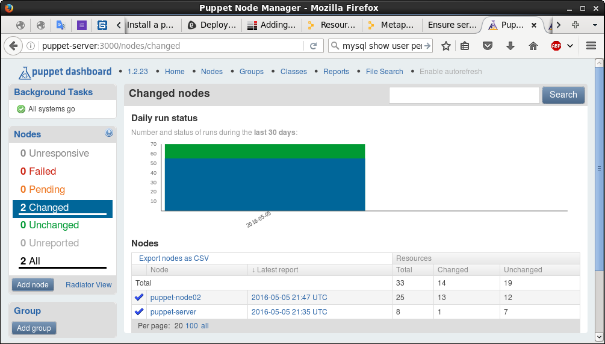
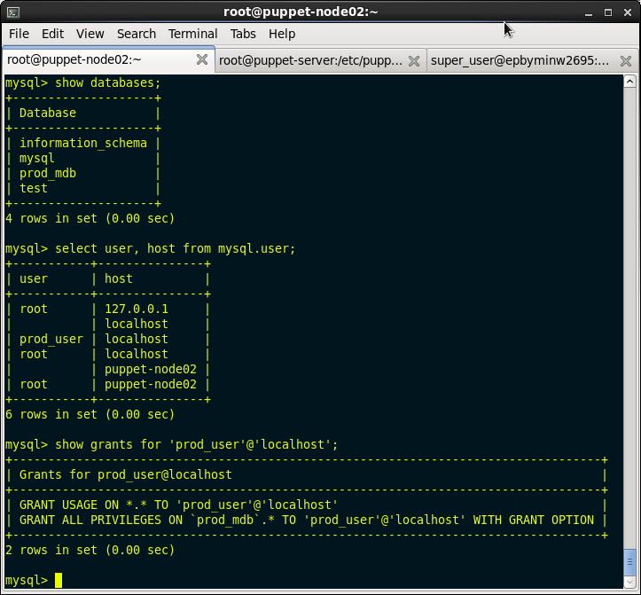
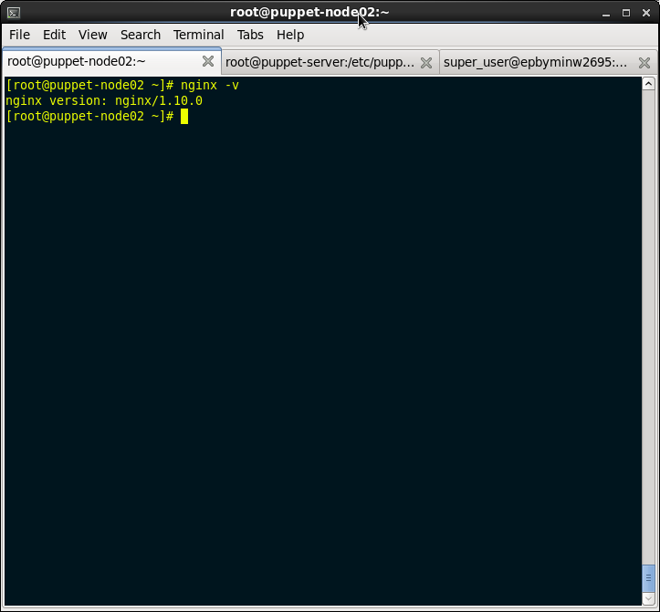
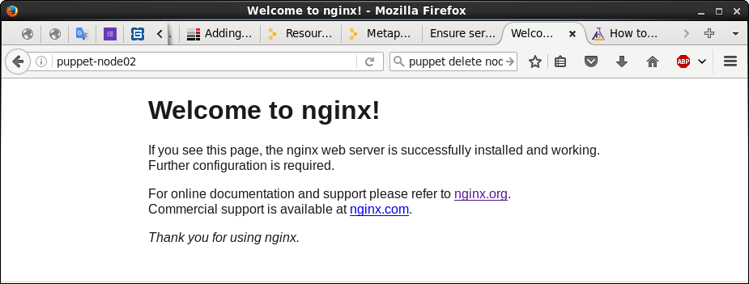
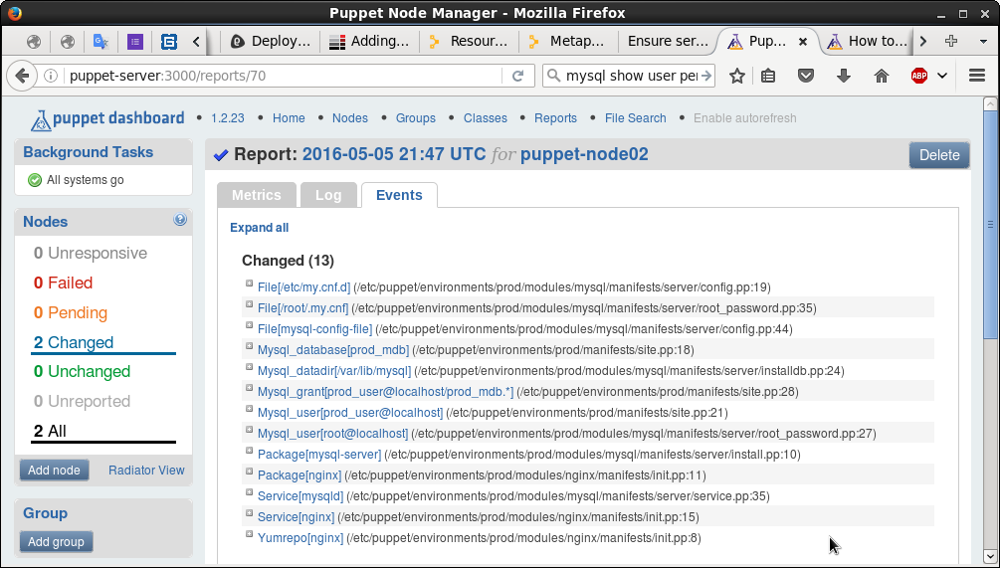

# puppet_task3

Install puppet dashboard on puppet master verify thet your current client is connected

Create new environment called “prod”, which should install nginx, create new mysql “prod_mdb” database, new user called “prod_user” and grant “prod_user” access to “prod_mdb”

