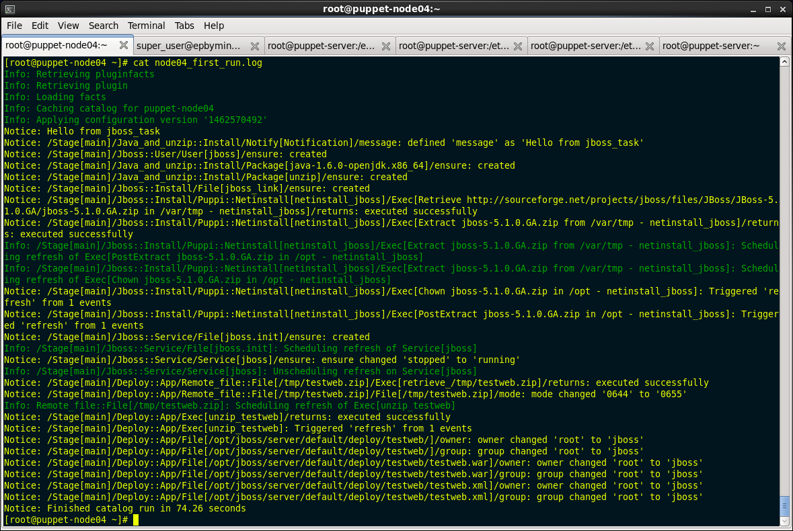
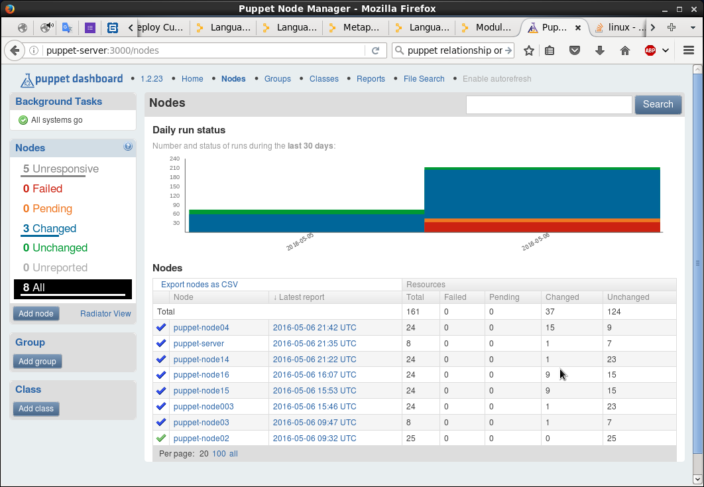
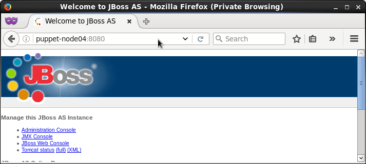
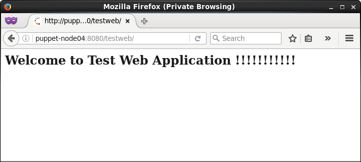

# puppet_task4

main [site.pp](environment/manifests/site.pp) file, see puppet-node04 section

java_and_unzip [install.pp](environment/modules/java_and_unzip/manifests/install.pp) module file

deploy [app.pp](environment/modules/deploy/manifests/app.pp) module file

remote_file [file.pp](environment/modules/remote_file/manifests/file.pp)  module (to download from http any files in specified dir)

